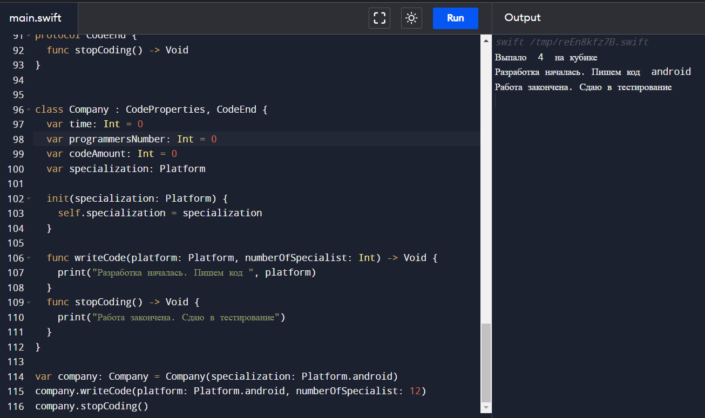

# vibe-lab-repo-10
0371 Копылов К.А.



```swift
struct IOSCollection  {
 var collectionId: Int;
}

class Ref<T> {
  var value: T
  init(value: T) {
    self.value = value
  }
}

struct Container<T> {
  var ref: Ref<T>
  init(value: T) {
    self.ref = Ref(value: value)
  }

  var value: T {
    get {
      ref.value
    }
    set {
      guard (isKnownUniquelyReferenced(&ref)) else {
        ref = Ref(value: newValue)
        return
      } 
      ref.value = newValue
    } 
  }
}

var collection = IOSCollection(collectionId: 1)
var contanier1 = Container(value: collection)
var contanier2 = contanier1

protocol Hotel {
  init(roomCount: Int)
}

class HotelAlfa: Hotel {
  var roomCount: Int
  required init(roomCount: Int) {
    self.roomCount = roomCount
  }
}

protocol GameDice {
  var numberDice: String { get }
}

extension Int: GameDice {
  var numberDice: String {
    return "Выпало  \(self)  на кубике"
  }
}

let diceCoub = 4 
print(diceCoub.numberDice)

@objc protocol Human {
  var name: String {get set}
  @objc optional var surname: String {get set}

  func printInfo() -> Void
}

class Student : Human {
  var name: String
  var group: String

  init(group: String, name: String) {
    self.group = group
    self.name = name
  }

  func printInfo() -> Void {
    print("Группа: \(group), Имя: \(name)")
  }  
}

enum Platform {
  case ios, android, web
}

protocol CodeProperties {
  var time: Int {get set}
  var codeAmount: Int {get set}
  func writeCode(platform: Platform, numberOfSpecialist: Int) -> Void
}

protocol CodeEnd {
  func stopCoding() -> Void
}


class Company : CodeProperties, CodeEnd {
  var time: Int = 0
  var programmersNumber: Int = 0
  var codeAmount: Int = 0
  var specialization: Platform

  init(specialization: Platform) {
    self.specialization = specialization
  }
  
  func writeCode(platform: Platform, numberOfSpecialist: Int) -> Void {
    print("Разработка началась. Пишем код ", platform)
  }
  func stopCoding() -> Void {
    print("Работа закончена. Сдаю в тестирование")
  }
}

var company: Company = Company(specialization: Platform.android)
company.writeCode(platform: Platform.android, numberOfSpecialist: 12)
company.stopCoding()
```
